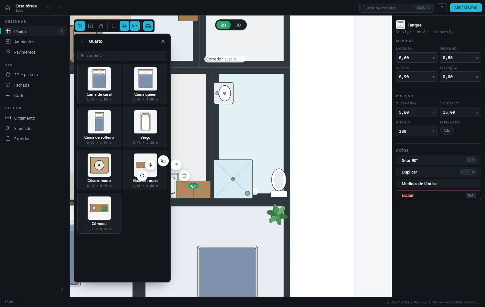
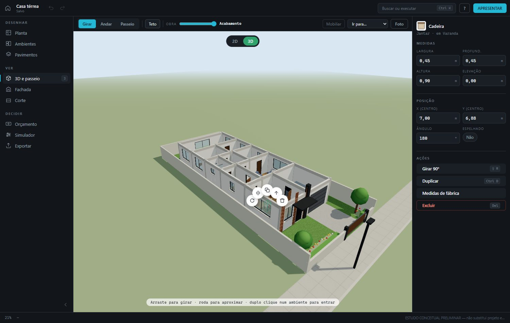
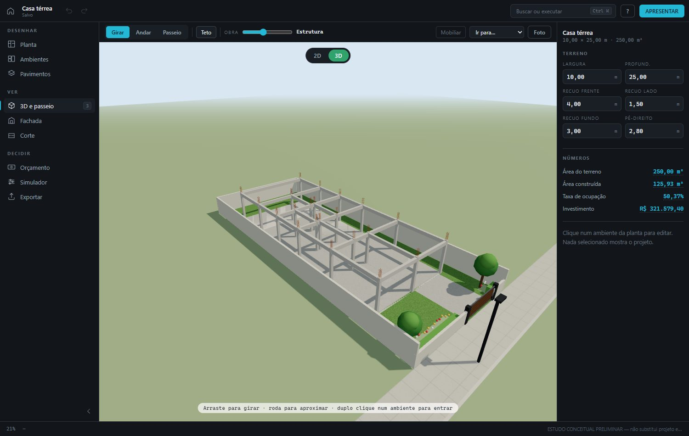
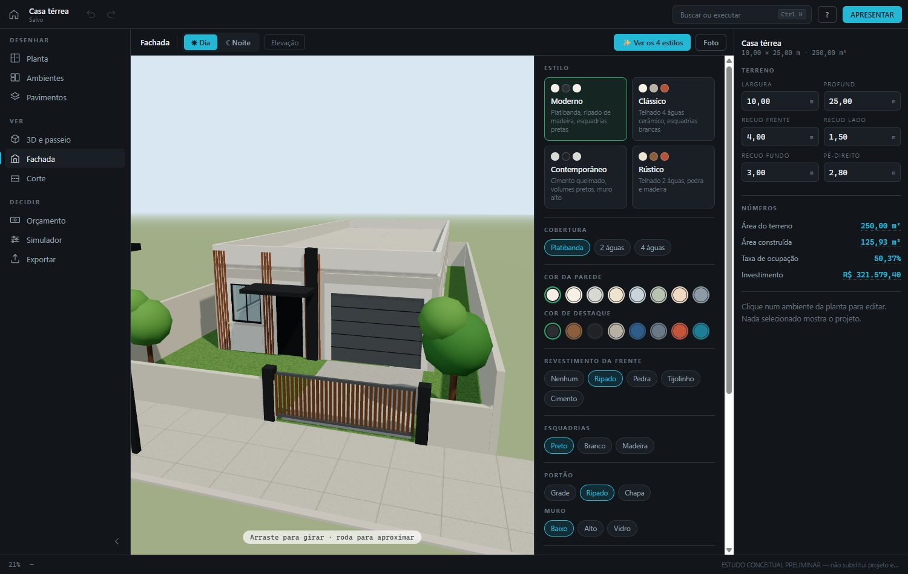
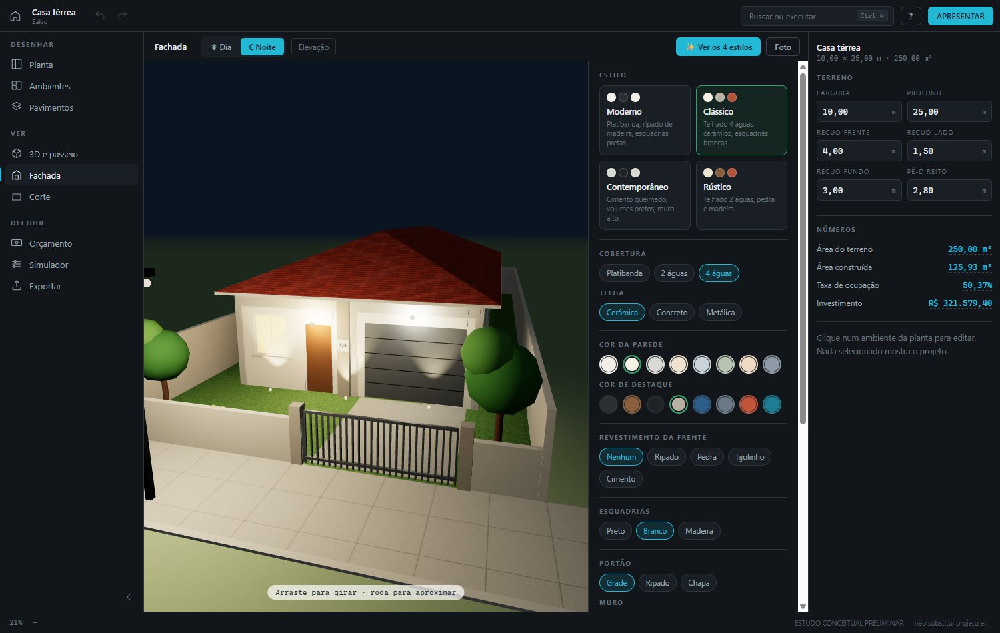
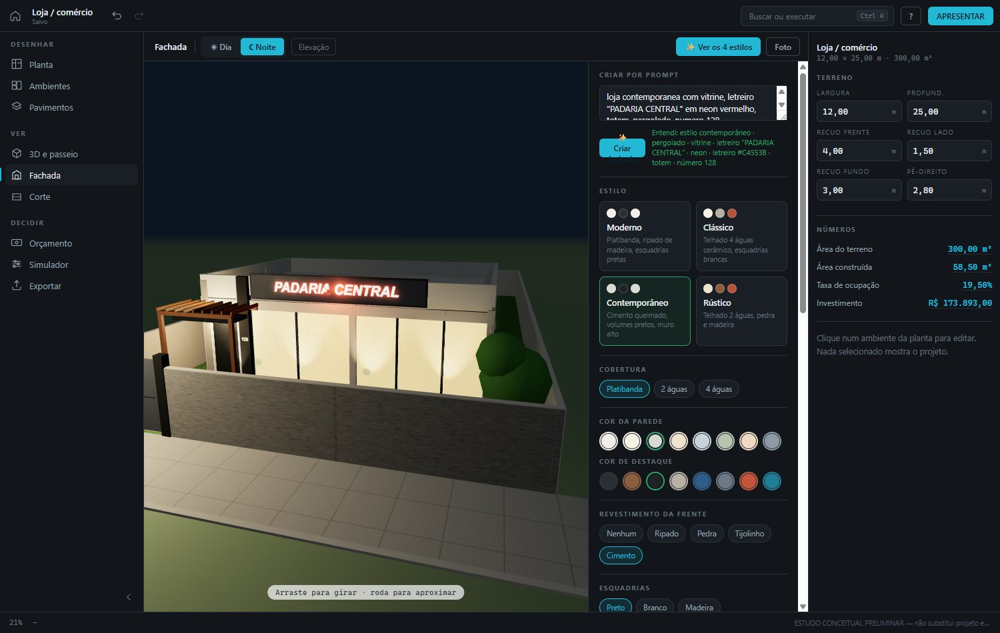
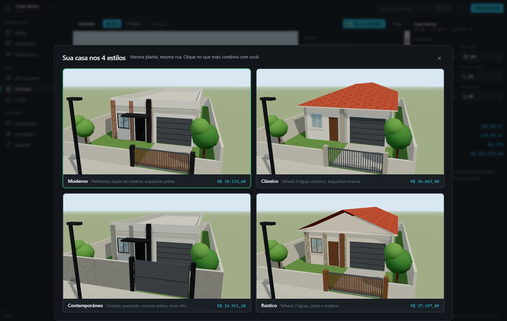

# SUA OBRA 3D — do projeto à realidade

**No ar: https://renanlrs.github.io/sua-obra-3d/**

App de planta de casas que roda direto no navegador — pelo link acima ou com **duplo clique em `index.html`**. Sem instalação, sem `npm`, sem servidor, sem conta.
Guia completo de uso, atalhos e arquitetura em [`LEIA-ME.md`](LEIA-ME.md). Verificação automática em [`test.html`](test.html) (99 checagens).

## O que o app faz — e de onde veio cada parte

### 1. Planta 2D com móveis "figurinha" (referência: Planner 5D)
Cada móvel é uma figurinha vista de cima — cama com travesseiros, sofá, fogão, vaso, carro… Catálogo com 44 itens em 9 categorias (tecla `M`), arrasta do catálogo para a planta, o item selecionado ganha **cotas verdes até as paredes**, alça de giro e **menu radial** (girar, espelhar, duplicar, elevar, excluir).



### 2. Modo 3D — casa de boneca, andar e passeio (referência: Planner 5D)
Pill **2D / 3D** no topo. Os mesmos móveis da planta aparecem no 3D e podem ser **clicados e arrastados pelo piso**. Modos Girar / Andar (WASD) / Passeio cômodo a cômodo, botão Teto e slider Obra.



### 3. Etapa Estrutura (referência: esqueleto de concreto)
No slider **OBRA**: terreno → fundação → **estrutura** (sapatas, pilares em cada canto e encontro de parede, baldrames, vigas, arranques de ferro) → alvenaria → cobertura → acabamento.



### 4. Fachada — designer próprio da frente da casa (na mesma tela do 3D)
**3D e fachada é uma tela só** (21/09): Girar/Andar/Passeio, dia/noite, teto, obra 4D, Mobiliar, "Ir para…" (frente da casa, entrada, cada ambiente), + Render e o painel **🎨 Fachada** à direita (tecla `F` abre/fecha; some o inspector para o 3D ficar largo; no celular vira folha de baixo). O painel tem atalhos no topo (Prompt · Estilo · Cobertura · Cores · Janelas · Porta · Muro · Letreiro · Custo) e o menu ⋯ guarda elevação, ✨ estilos, foto e apresentar. Oito estilos de partida (Moderno, Clássico, Contemporâneo, Rústico), cobertura (platibanda, 2 ou 4 águas), telha, cores, **revestimento da frente** (ripado, pedra, tijolinho, cimento — recortado nas portas e janelas), esquadrias, portão, muro, jardim, marquise, número da casa. Tudo com **quanto custa**, item por item.



**☾ Noite** — janelas acesas, spots na fachada, luz da entrada e poste da rua.



**Fachada comercial e criar por prompt** — letreiro com o nome do estabelecimento (placa, letra caixa, LED, neon, backlight; aceso à noite; totem), vitrine, pergolado. Ou descreva em uma frase e o app monta.



**✨ Ver os 4 estilos** — fotografa a *sua* planta nos quatro estilos, lado a lado, com o custo de cada um. Clicou, aplicou.



### 5. Orçamento, simulador, apresentação e exportação
Custo por m² por tipo de ambiente + custo da fachada; simulador de meta; apresentação cinematográfica com passeio 3D dirigido pelo scroll; exporta SVG, PNG, PDF, `.json` e **passeio 3D em HTML** (um arquivo, abre no celular).

### 6. Fusão com o ACQUA BELO — piscina, orçamento por etapa, cenários, camadas, cotas, relatório, renders, versões
As funções do app da escola de natação passaram a viver no mesmo editor, lendo a mesma planta:
- **Escola de natação** é um programa pronto (15 × 20 m): rua → corredor → controle de acesso → vestiários → salão com a **piscina 12,50 × 6,00 m e 4 raias** dentro; administração e deck do animador no 2º pavimento.
- **Aba Piscina**: comprimento, largura, profundidade mín./máx., raias e largura da raia; praias medidas até as paredes do salão (mín. 1,50 m laterais · 0,50 m cabeceiras), volume, área molhada, alertas, aquecimento e filtragem. No 3D a piscina tem a profundidade real, cordas de raia, blocos de partida e o piso do salão recortado.
- **Orçamento por etapa da obra** (a mesma sequência do slider OBRA): composição em fundação/estrutura/alvenaria/cobertura/instalações/acabamentos, grupos Piscina e Fachada, reserva técnica e faixa −12 %/+18 %.
- **Simulador de cenários**: cada linha mostra o Δ R$ (acabamento econômico, piscina 11/12,5/15 m, sem 2º andar, sem o menor ambiente…) e aplica com um clique, com desfazer.
- **Camadas** (visível/bloqueada), **Cotas** (todas as medidas, editáveis; cotas livres), **Relatório técnico** com alertas inteligentes, **Renders** (botão **+ Render** no 3D e na fachada, ou envio de imagem; entram na apresentação), **Versões do estudo** e exportação em CSV/TXT.

### 8. Copiar de uma FOTO (em vez de descrever)
- **Planta**: botão 📷 na barra da planta (ou na tela inicial, na aba Ambientes, no botão direito) → mande a foto/print de uma planta baixa e o app desenha os ambientes no seu terreno (nome, tipo, medidas; os recuos cedem para a planta caber; móveis automáticos). Substitui o andar atual, com desfazer.
- **Fachada**: 📷 *Copiar de uma foto* ao lado de "Criar fachada" → a foto de uma casa ou loja vira as escolhas (telhado, cores, revestimento, esquadrias, janelas, porta, portão, muro, jardim, letreiro).
- Usa o **Gemini** com uma chave sua (grátis em aistudio.google.com/apikey), guardada só no navegador. Arquivo `visao.js`: a IA devolve JSON; o app normaliza (frações → cm, snap 5 cm, mínimo 0,90 m, divisas encostadas, só valores válidos) — nada é desenhado pela IA.

### 7. Prático: clique no item para trocar · botão direito para agir
- No **3D e fachada**, passe o mouse: janela, porta, telhado, parede, revestimento, muro, portão, piso da frente, letreiro… viram clicáveis. **Clique** → aparece só o que dá para trocar naquele item; cada escolha aplica na hora e o popover fica aberto para comparar. "Todas as opções" leva ao painel completo.
- **Portas e janelas na planta 2D**: desenhadas da mesma análise do 3D (folha + arco de abertura, janelas nas paredes externas, portão tracejado, ponto azul = entrada principal); clique ou botão direito nelas abre o mesmo popover de trocar/excluir/medidas.
- **Cada janela/porta/parede é sua**: clique numa janela → excluir, quantas nesta parede (1–4), largura/altura/peitoril, tipo e vidro só dela; clique numa parede → + janela, + porta, ★ entrada principal aqui; clique na porta → excluir (se secundária) ou voltar ao automático. Fica em `proj.aberturas` (chave ambiente|lado|índice) e `proj.entradaEm`; o painel lista tudo o que foi decidido, com ↺.
- **Arte / logo anexada**: 📎 no letreiro (popover ou painel) — PNG com transparência fica melhor; a arte substitui o texto no letreiro, outdoor, bandeira, placa do muro, totem e adesivo da vitrine (`proj.logo`, fora do undo).
- **Tamanho de qualquer porta**: clique na porta (entrada, adicionada, interna entre cômodos ou portão da garagem) → largura/altura só dela; porta interna também pode ser excluída.
- **Placas publicitárias**: letreiro na parede / sobre a marquise / **no topo (outdoor)**, **bandeira lateral**, **placa no muro**, totem, **adesivo na vitrine** e **faixa/banner** com texto e cor próprios — tudo no popover do letreiro, no painel e no prompt ("letreiro no topo, bandeira, faixa \"PROMOÇÃO\"").
- **8 estilos**: moderno, clássico, contemporâneo, rústico + industrial, minimalista, mediterrâneo, tropical ("Ver os 8 estilos" fotografa todos).
- **Arrastar no 3D**: pegue uma **janela, porta, portão ou porta interna** e arraste pela parede — ela para na folga de 15 cm e não invade a porta ao lado (pula para o trecho livre mais perto); solte sem mover = clique normal. O **letreiro** também arrasta pela fachada (posição livre em m). Grava em `proj.aberturas[chave].pos/ppos` e `fachada.letreiroX/Y`; ↺ volta ao automático; 2º dedo cancela sem gravar.
### ☀ Sol de verdade — estudo de insolação (23/09)
Menu **⋯ → Sol de verdade** (ou Ctrl+K). Escolha a **cidade** (12 capitais e Campinas), a **data** (21/dez, 21/jun, equinócio ou hoje), a **hora** (slider de 5h às 19h, com “▶ Rodar o dia”) e gire o **Norte** até bater com o terreno: o sol do 3D vai para a posição astronômica real — nascer, pôr, altura e direção — e as sombras andam junto, com a cor e a força mudando do alaranjado do fim de tarde ao branco do meio-dia. A tabela mostra **quantas horas de sol cada ambiente recebe naquele dia**, medindo do lado de fora de cada parede externa (onde ficaria a janela), de 15 em 15 minutos, contando a sombra da própria casa e das coberturas — ambiente de miolo aparece marcado. Fica em `proj.sol`.

### 🎬 Vídeo do projeto (23/09) — o entregável para o cliente
Menu **⋯ → Gerar vídeo do projeto** (ou Ctrl+K): o app roda sozinho um roteiro de câmera — capa com o nome e a metragem, chegada pela calçada, cada ambiente por dentro, os externos e a vista aérea com o investimento — grava o canvas com `MediaRecorder` e **baixa um MP4** (cai para WebM se o navegador não tiver MP4). Legendas, barra de tempo, o seu logo na capa e assinatura discreta são desenhados por cima num canvas 2D. Dá para escolher o ritmo (curto/normal/devagar) e ligar **narração em voz alta** (voz do sistema, pt-BR) enquanto grava. Tudo acontece na sua máquina — nada é enviado para a internet.

- **Veículos, eletrônicos, palco e instalações (23/09)**: **166 itens em 17 categorias**. **Veículos**: carro, compacto, SUV, picape, van, caminhão baú, ônibus, moto, bicicleta. **TV, som e câmeras**: TV 50/65/85", painel de LED, monitor, projetor, tela de projeção, soundbar, caixa torre / de parede / de teto, subwoofer, câmera bullet, dome e 360°, DVR. **Palco e eventos**: palco, praticável, treliça de iluminação, refletor, line array, mesa de som, microfone com pedestal, telão. **Instalações**: ar split, cassete, piso-teto e de janela, condensadora, exaustor de parede / eólico de telhado / de banheiro, caixa d'água 500 e 1.000 L, caixa d'água em torre, cisterna, aquecedor solar, placa fotovoltaica, quadro de energia, bomba. **Vitrines**: vitrine de loja, balcão vitrine refrigerado, vitrine ilha, expositor de parede, provador. Itens de parede e teto (TV, split, câmera, treliça, caixa de teto) já **nascem na altura certa**.
- **Catálogo grande (23/09)**: **115 móveis em 13 categorias** — as novas são **Infantil**, **Lazer e piscina**, **Academia** e **Comércio**; entraram sofá de canto, painel de TV, lareira, cooktop, coifa, forno, micro-ondas, lava-louças, adega, cama king, penteadeira, closet, beliche, escorregador, gabinete, mesa em L, armário de aço, secadora, varal, boiler, freezer, moto, bicicleta, banco de jardim, cerca-viva, guarda-sol, ofurô, ducha, escada de piscina, trampolim, rede, esteira, bike ergométrica, supino, halteres, tatame, balcão de atendimento, gôndola, arara, manequim, caixa registradora, freezer expositor, quadro, espelho, cortina, pendente e mais. Cada um tem figurinha própria na planta e peça no 3D, e o **mobiliar automático** já usa os novos (coifa, gabinete, espelheira, varal, bicicleta).
- **Mais aberturas (23/09)**: **12 tipos de janela** (+ maxim-ar, pivotante, sanfonada, cobogó, vitrô, com persiana, bandeira em arco), **7 vidros** (+ leitoso, canelado, bronze), **12 portas de entrada** (+ almofadada, com vidro lateral, com bandeira, francesa, porta-balcão, camarão), **9 de loja** (+ blindex, giratória, vidro com cortina de ar), **8 portas internas** com tipo por porta (lisa, almofadada, visor, de correr, embutida, camarão, francesa, veneziana), **7 portas de garagem** (+ seccionada, pivotante, deslizante), **6 portões** (+ deslizante, lança, chapa perfurada) e **6 muros** (+ cobogó, gradil, pedra). Tudo com preço no orçamento e entendido pelo prompt ("janela maxim-ar com vidro canelado, muro de cobogó, portão deslizante, portas internas embutidas").
- **Cobertura independente (telhado à parte)**: pilares próprios + telhado separado da casa — garagem coberta, área da piscina, pergolado, quadra/galpão. **Tipos**: 2 águas, 1 água, 4 águas, arco, laje plana, pergolado, tela sombrite. **Pilares**: concreto, metálico, madeira, pilastra de alvenaria, pedra, tubo redondo — com seção, pé-direito e quantos em cada direção (o miolo fica livre; vão grande ganha tesoura à vista e o app avisa acima de 6 m). Telha, inclinação, beiral, calha, forro e cor. Nasce pela ferramenta **telhado (T)** arrastando na planta, pelos atalhos do painel 🎨 Fachada (*garagem · área da piscina · pergolado · quadra*, que nascem sobre o ambiente certo), pelo botão direito ou pelo Ctrl+K. Arrasta e redimensiona na planta e no 3D; entra no orçamento (pilares na fundação, telhado na cobertura), no relatório e nos alertas. Mora em `proj.coberturas` — **não é ambiente**: não muda área construída nem taxa de ocupação.
- **Coberturas de galpão / ginásio**: além de platibanda / 2 águas / 4 águas, **Galpão metálico** (2 águas baixas com tesouras treliçadas, terças e pilares), **Arco metálico** e **Shed (dente de serra, com faces de policarbonato)** — sem laje: a estrutura fica à vista por dentro. **Inclinação** (baixa/média/alta), **beiral** em m, **cor da estrutura**, telhas **fibrocimento** e **termoacústica**. No prompt: "galpão de estrutura metálica para ginásio, telha sanduíche, beiral de 80 cm, estrutura azul", "cobertura em arco", "shed".
- **Arte dentro do letreiro**: tamanho (30–150 %), deslocar esquerda⇄direita e baixo⇅cima, **nome ao lado da arte**; largura/altura/altura do chão do letreiro em m (popover do letreiro ou painel).
- Na **Planta**, **arraste no vazio** para laçar: tudo que ficar dentro (ambientes + os móveis deles, móveis avulsos) vira um grupo — arraste qualquer item e todos vão juntos; ⇧ clique adiciona/retira; Ctrl+A seleciona o andar; Del/Ctrl+D/setas agem no grupo; dá para mandar o grupo para outro andar. Mover um ambiente sozinho também leva os móveis dele.
- Na **Planta**, **botão direito** em um ambiente (renomear, tipo, mobiliar só ele, duplicar, girar, andar, excluir), em um móvel (girar, espelhar, duplicar, elevar, **trocar por outro**, excluir) ou no vazio (adicionar ambiente aqui, mobiliar, enquadrar, desfazer).

## Conferir sem clicar
```
index.html?demo=escola-natacao&l=15&p=20&v=planta
index.html?demo=escola-natacao&l=15&p=20&v=piscina
index.html?demo=escola-natacao&l=15&p=20&v=tresd&t3=tour&i=6
index.html?demo=casa-terrea&l=10&p=25&v=planta&ctx=amb
index.html?demo=loja&l=12&p=25&v=fachada&fpop=janela
index.html?demo=zero&l=15&p=20&v=planta&chave=AIza…&foto=minha-planta.png   (foto servida na mesma origem)
index.html?demo=casa-terrea&l=10&p=25&v=planta&cat=1&catk=quarto&selmov=20
index.html?demo=casa-terrea&l=10&p=25&v=tresd&teto=0
index.html?demo=casa-terrea&l=10&p=25&v=tresd&etapa=2
index.html?demo=casa-terrea&l=10&p=25&v=fachada&estilo=classico&num=128&noite
index.html?demo=casa-terrea&l=10&p=25&v=fachada&estilos4
```

> ESTUDO CONCEITUAL PRELIMINAR — não substitui projeto executivo, licenciamento ou ART/RRT.
